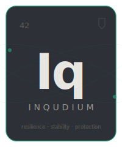

<p align="center">
  
</p>

<h1 align="center">Inqudium</h1>

<p align="center">
  <strong>The resilience element for your application.</strong><br/>
  Fortify your services against the outside world — element by element.
</p>

<p align="center">
  
  
  
</p>

---

> **⚠️ There is no release yet. No artifacts, no working code, nothing to install or try.**
>
> This repository documents the **architecture and vision** for Inqudium. The project is being built in the open from day one. What you see here is a blueprint — not a product.
>
> If the approach resonates with you, star this repo to follow progress. Architecture feedback and design discussions are welcome right now — code contributions will follow once the foundation is in place.

---

## What will Inqudium be?

Inqudium will be a fault-tolerance library for Java 21+ and Kotlin that takes a fundamentally different approach: instead of bridging resilience patterns across execution models, every paradigm will get its own **native implementation**.

A Kotlin Circuit Breaker will use `Mutex` — not `ReentrantLock`. A Reactor Retry will wait with `Mono.delay()` — not `LockSupport.parkNanos`. Backpressure won't be bolted on. It will flow from the native `Flow`, `Subscription`, or `Flowable`.

Configuration, algorithms, and events shared. Execution native. That's the plan.

## The blueprint

```
┌─────────────────── inqudium-core (SPI) ──────────────────┐
│  Configs  │  Pure Algorithms  │  Events  │  Contracts    │
└──────┬────────────┬──────────────┬────────────┬──────────┘
       │            │              │            │
  Imperative     Kotlin        Reactor      RxJava 3
  ReentrantLock  Mutex         Sinks.One    Subject
  parkNanos      delay()       Mono.delay   Single.timer
  Semaphore      k.c.Sem.      flatMap(n)   flatMap(n)
```

### Planned elements

| Symbol | Element           | Description                                                                 |
|--------|-------------------|-----------------------------------------------------------------------------|
| **Cb** | Circuit Breaker   | Stops cascading failures by short-circuiting calls to unhealthy services.   |
| **Rt** | Retry             | Automatically retries failed operations with configurable backoff.          |
| **Rl** | Rate Limiter      | Controls throughput to prevent overloading downstream systems.              |
| **Bh** | Bulkhead          | Isolates failures by limiting concurrent access to a resource.              |
| **Tl** | Time Limiter      | Guards against slow responses by enforcing execution time boundaries.       |
| **Ca** | Cache             | Caches successful results to reduce load and improve response times.        |

### Planned modules

| Module                       | Artifact ID                      | Status       |
|------------------------------|----------------------------------|--------------|
| Core (SPI)                   | `inqudium-core`                  | Not started  |
| Circuit Breaker (imperative) | `inqudium-circuitbreaker`        | Planned      |
| Retry (imperative)           | `inqudium-retry`                 | Planned      |
| Rate Limiter (imperative)    | `inqudium-ratelimiter`           | Planned      |
| Bulkhead (imperative)        | `inqudium-bulkhead`              | Not started  |
| Time Limiter (imperative)    | `inqudium-timelimiter`           | Planned      |
| Cache (imperative)           | `inqudium-cache`                 | Planned      |
| Kotlin Coroutines (native)   | `inqudium-kotlin`                | Planned      |
| Project Reactor (native)     | `inqudium-reactor`               | Planned      |
| RxJava 3 (native)            | `inqudium-rxjava3`               | Planned      |
| Spring Boot Starter          | `inqudium-spring-boot3`          | Planned      |
| Micrometer                   | `inqudium-micrometer`            | Planned      |
| Java Flight Recorder         | `inqudium-jfr`                   | Planned      |
| Resilience4J Compatibility   | `inqudium-compat-resilience4j`   | Planned      |

## Design principles (planned)

**Native per paradigm** — Every execution model will get its own implementation built on that model's primitives. No thread bridges, no blocking wrappers.

**Shared contracts, no duplication** — `inqudium-core` will define configs, pure algorithms, and events once. The *what* is shared, the *how* is native per paradigm.

**Virtual-thread ready** — The imperative layer will use `ReentrantLock` (not `synchronized`) and `LockSupport.parkNanos` (not `Thread.sleep`) to avoid pinning virtual threads.

**Resilience4J drop-in compatible** — A planned compatibility module will let you swap the Maven dependency and keep your annotations, YAML, and Grafana dashboards.

## Get involved

Right now the most valuable contributions are **ideas, not code**:

- **Architecture feedback** — Does the native-per-paradigm approach make sense for your stack? What would you need?
- **Use cases** — What resilience pain points do you hit in production that existing libraries don't solve well?
- **Design discussions** — Open an issue or join an existing one. Every perspective shapes the outcome.

Code contributions will open up once `inqudium-core` compiles and has a test harness to build against. We'll announce that milestone here.

## Follow the progress

Star this repository to get notified about releases. Major milestones will be documented in [CHANGELOG.md](CHANGELOG.md).

---

## License

Apache License 2.0 — see [LICENSE](LICENSE).
This documentation is licensed under
<a href="https://creativecommons.org/licenses/by/4.0/">CC BY 4.0</a>

<p align="center">
  <sub><strong>Iq</strong> — The resilience element for your application.</sub>
</p>
