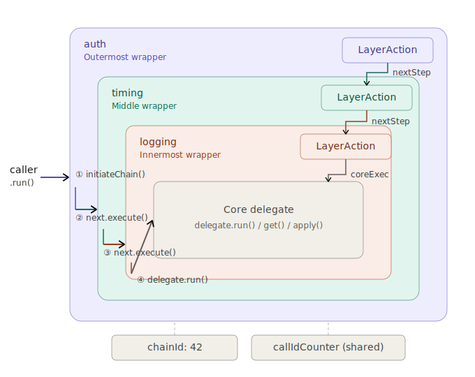

# Inqudium Wrapper Pipeline — Developer Guide

## Overview

The Inqudium Wrapper Pipeline is a chain-of-responsibility framework that lets you wrap any functional interface (or
service interface) with composable layers of cross-cutting logic — logging, metrics, resilience, caching, authorization,
and more — without modifying the original code.

Every layer in the chain has **around-semantics**: it decides *when*, *whether*, and *how* to invoke the next layer,
much like a Servlet Filter or Spring AOP `@Around` advice.

---

## Core Concepts



### Wrapper Chain

A wrapper chain is an immutable, linked sequence of layers that all share the same **chain ID**. Each invocation through
the chain receives a unique **call ID**, giving you two zero-allocation primitives for tracing and correlation.

```
Outer Layer  →  Middle Layer  →  Inner Layer  →  Core Delegate
 (chainId=7)     (chainId=7)      (chainId=7)     (the real work)
```

### LayerAction

`LayerAction<A, R>` is the fundamental building block. It is a functional interface with a single method:

```java
R execute(long chainId, long callId, A argument, InternalExecutor<A, R> next);
```

The `next` parameter represents the remainder of the chain. You call `next.execute(chainId, callId, argument)` to
proceed, or skip it to short-circuit.

#### Common Patterns

**Pre-processing (logging)**

```java
LayerAction<Void, Void> logging = (chainId, callId, arg, next) -> {
    log.info("[chain={}, call={}] entering", chainId, callId);
    return next.execute(chainId, callId, arg);
};
```

**Pre- and post-processing (timing)**

```java
LayerAction<Void, Object> timing = (chainId, callId, arg, next) -> {
    long start = System.nanoTime();
    Object result = next.execute(chainId, callId, arg);
    metrics.record(System.nanoTime() - start);
    return result;
};
```

**Exception handling (resilience)**

```java
LayerAction<Void, Object> fallback = (chainId, callId, arg, next) -> {
    try {
        return next.execute(chainId, callId, arg);
    } catch (Exception e) {
        return defaultValue;
    }
};
```

**Conditional execution (caching)**

```java
LayerAction<I, O> caching = (chainId, callId, arg, next) -> {
    if (cache.containsKey(arg)) return cache.get(arg);
    O result = next.execute(chainId, callId, arg);
    cache.put(arg, result);
    return result;
};
```

**Pass-through (no-op)**

When you need a wrapper layer structurally but don't need custom behavior, use the shared singleton:

```java
LayerAction.passThrough()
```

---

## Homogeneous Wrappers

Homogeneous wrappers wrap a well-known functional interface with type-safe chains. The delegate and the wrapper
implement the same interface, so they are drop-in replacements.

| Wrapper Class          | Wraps                  | Entry Method |
|------------------------|------------------------|--------------|
| `RunnableWrapper`      | `Runnable`             | `run()`      |
| `SupplierWrapper<T>`   | `Supplier<T>`          | `get()`      |
| `FunctionWrapper<I,O>` | `Function<I,O>`        | `apply(I)`   |
| `CallableWrapper<V>`   | `Callable<V>`          | `call()`     |
| `JoinPointWrapper<R>`  | `JoinPointExecutor<R>` | `proceed()`  |

### Creating a Wrapper

Every wrapper offers three constructor styles:

```java
// 1. With an InqDecorator (named element with LayerAction behavior)
new RunnableWrapper(decorator, myRunnable);

// 2. With a name and explicit LayerAction
new RunnableWrapper("timing", myRunnable, timingAction);

// 3. With a name only (pass-through, useful for structural wrapping)
new RunnableWrapper("identity", myRunnable);
```

### Stacking Layers

Because the wrapper implements the same interface as the delegate, you simply nest constructors:

```java
Runnable core = () -> System.out.println("Hello");

Runnable wrapped = new RunnableWrapper("auth",
    new RunnableWrapper("timing",
        new RunnableWrapper("logging", core, loggingAction),
        timingAction),
    authAction);

wrapped.run(); // auth → timing → logging → core
```

### Checked Exception Handling

`CallableWrapper` and `JoinPointWrapper` transport checked exceptions through the chain using `CompletionException` and
automatically unwrap them at the entry point. From the caller's perspective, the exception types are preserved exactly.

```java
Callable<String> risky = () -> { throw new IOException("disk full"); };
Callable<String> wrapped = new CallableWrapper<>("retry", risky, retryAction);

try {
    wrapped.call();
} catch (IOException e) {
    // original checked exception is preserved
}
```

---

## Dynamic Proxy Wrappers

For arbitrary service interfaces where you cannot (or don't want to) implement the interface yourself, the proxy system
creates JDK dynamic proxies that route every method call through the wrapper pipeline.

### InqProxyFactory

The simplest entry point:

```java
LayerAction<Void, Object> timing = (chainId, callId, arg, next) -> {
    long start = System.nanoTime();
    Object result = next.execute(chainId, callId, arg);
    recorder.record(System.nanoTime() - start);
    return result;
};

InqProxyFactory factory = InqProxyFactory.of("timing", timing);

MyService proxy = factory.protect(MyService.class, realService);
proxy.doWork(); // routed through the timing action
```

The factory enforces that the target type is an interface. Concrete classes are not supported.

### ProxyWrapper and DispatchExtension

Under the hood, `InqProxyFactory` delegates to `ProxyWrapper.createProxy`, which accepts one or more `DispatchExtension`
instances. Extensions are checked in registration order; the first whose `canHandle(method)` returns `true` dispatches
the call.

```java
T proxy = ProxyWrapper.createProxy(
    MyService.class,
    realService,
    "myProxy",
    specificExtension,   // handles certain methods
    syncCatchAll         // handles everything else (must be last)
);
```

**Validation rules enforced at construction time:**

- At least one extension is required.
- No null extensions.
- No duplicate instances (same object reference).
- Exactly one catch-all extension, and it must be the last in the array.
- Catch-all extensions before the last position cause an immediate error (unreachable extensions).

### SyncDispatchExtension

The built-in catch-all extension for synchronous dispatch. It wraps every method call through a
`LayerAction<Void, Object>`:

```java
SyncDispatchExtension ext = new SyncDispatchExtension(myAction);
```

It always returns `true` from `canHandle` and `true` from `isCatchAll`, so it must be registered last.

### Writing a Custom DispatchExtension

Implement the `DispatchExtension` interface to handle specific method signatures — for example, methods returning
`CompletableFuture` for async dispatch:

```java
public class AsyncDispatchExtension implements DispatchExtension {

    @Override
    public boolean canHandle(Method method) {
        return CompletableFuture.class.isAssignableFrom(method.getReturnType());
    }

    @Override
    public Object dispatch(long chainId, long callId,
                           Method method, Object[] args, Object target) {
        // async dispatch logic
    }
}
```

Register it before the sync catch-all:

```java
ProxyWrapper.createProxy(
    MyService.class, target, "mixed",
    new AsyncDispatchExtension(asyncAction),
    new SyncDispatchExtension(syncAction)    // catch-all last
);
```

### Chain-Walk Optimization

When proxies are stacked (a proxy wrapping another proxy), the framework automatically detects inner `DispatchExtension`
instances of the same type and links them into a direct chain walk. This bypasses the overhead of re-entering the inner
JDK proxy for each layer.

The linking happens transparently in the `ProxyWrapper` constructor via `DispatchExtension.linkInner`. If no
type-compatible counterpart exists in the inner proxy, the extension is left unlinked and dispatch falls through to the
inner proxy normally.

### Object Method Semantics

Proxies handle `Object` methods with well-defined behavior:

- **`equals`** — Two proxies are equal when they are the same wrapper subtype and wrap the same deep real target. A
  proxy is never equal to a bare (unwrapped) object.
- **`hashCode`** — Delegates to the deep real target, so equal proxies produce the same hash code.
- **`toString`** — Returns `"layerDescription -> realTarget.toString()"`.
- **`Wrapper` interface methods** (`inner()`, `chainId()`, `layerDescription()`, etc.) are dispatched to the invocation
  handler itself, not the target.

### MethodHandleCache

Each `DispatchExtension` holds a `MethodHandleCache` that converts `java.lang.reflect.Method` to
`java.lang.invoke.MethodHandle` on first use. The cache uses arity-specialized dispatch (0–5 parameters use direct
`invoke`, 6+ use a pre-built spreader) to avoid the overhead of `invokeWithArguments`.

You don't interact with this cache directly — it is managed internally by the dispatch extensions.

---

## Inspecting a Wrapper Stack from the Outside

One of the key design goals of the framework is that a wrapper chain is fully introspectable at runtime. Every wrapper —
whether homogeneous or proxy-based — implements the `Wrapper` interface, which provides a consistent API for examining
the chain without executing it.

### Available Introspection Methods

| Method                | Returns             | Purpose                                                                                                                         |
|-----------------------|---------------------|---------------------------------------------------------------------------------------------------------------------------------|
| `chainId()`           | `long`              | Unique ID shared by every layer wrapping the same core delegate. Two wrappers with the same chain ID belong to the same stack.  |
| `currentCallId()`     | `long`              | The most recent call ID generated by this chain's shared counter. Useful for correlating log output after an invocation.        |
| `layerDescription()`  | `String`            | Human-readable label of this specific layer (e.g. `"BULKHEAD(pool-A)"` or `"timing"`).                                          |
| `inner()`             | `Wrapper` or `null` | The next layer inward. Returns `null` when you have reached the innermost wrapper (the layer directly above the core delegate). |
| `toStringHierarchy()` | `String`            | Pre-formatted tree view of the entire stack (see below).                                                                        |

### Walking the Chain Manually

Because `inner()` returns the next `Wrapper` (or `null`), you can iterate through every layer with a simple loop:

```java
Wrapper<?> current = outermost;
while (current != null) {
    System.out.println(current.layerDescription());
    current = current.inner();
}
```

This is useful for programmatic checks — for example verifying in a test that a certain decorator is present in the
stack, or counting the number of layers:

```java
int depth = 0;
Wrapper<?> cursor = wrapper;
while (cursor != null) {
    depth++;
    cursor = cursor.inner();
}
// depth now holds the total number of wrapper layers
```

### Collecting All Layer Descriptions

A common diagnostic pattern is to collect the descriptions into a list:

```java
List<String> layers = new ArrayList<>();
Wrapper<?> cursor = outermost;
while (cursor != null) {
    layers.add(cursor.layerDescription());
    cursor = cursor.inner();
}
// layers = ["auth", "timing", "logging"]
```

### Hierarchy Visualization with toStringHierarchy()

For quick diagnostics — logging, debugging, or test assertions — `toStringHierarchy()` renders the full chain as an
indented tree:

```java
System.out.println(wrapper.toStringHierarchy());
```

Output:

```
Chain-ID: 42 (current call-ID: 7)
auth
  └── timing
    └── logging
```

The output includes the shared chain ID and the current call ID, making it easy to correlate with trace logs. A built-in
depth guard truncates at 100 layers to protect against corrupted or cyclic chains.

### Verifying Chain Identity

Because all layers in a stack share the same `chainId()`, you can verify that two references belong to the same chain:

```java
assert outerLayer.chainId() == innerLayer.chainId();
```

This is particularly useful in tests to confirm that wrapping did not accidentally create a disconnected chain.

### Inspecting Proxy-Based Wrappers

Dynamic proxies created via `InqProxyFactory` or `ProxyWrapper.createProxy` also implement `Wrapper`. You can cast and
inspect them the same way:

```java
MyService proxy = factory.protect(MyService.class, realService);

// The proxy implements Wrapper — cast to access introspection
Wrapper<?> w = (Wrapper<?>) proxy;
System.out.println(w.toStringHierarchy());
System.out.println("Chain ID: " + w.chainId());
```

When proxies are stacked (a proxy wrapping another proxy), `inner()` traverses through each proxy layer:

```java
MyService inner = InqProxyFactory.of("logging", loggingAction)
    .protect(MyService.class, realService);

MyService outer = InqProxyFactory.of("auth", authAction)
    .protect(MyService.class, inner);

Wrapper<?> w = (Wrapper<?>) outer;
System.out.println(w.toStringHierarchy());
```

```
Chain-ID: 5 (current call-ID: 0)
auth
  └── logging
```

### Observing Call Activity

The `currentCallId()` method returns the latest value of the chain's shared call counter. This counter increments with
every invocation that enters the chain. By reading it before and after a call, you can confirm that an invocation
actually traversed the chain:

```java
Wrapper<?> w = (Wrapper<?>) proxy;
long before = w.currentCallId();
proxy.doWork();
long after = w.currentCallId();

assert after == before + 1; // exactly one invocation passed through
```

### The inner() Boundary

`inner()` returns `null` when the delegate of a layer is not itself a wrapper of a compatible type. This means:

- For homogeneous wrappers (e.g. `RunnableWrapper`), `inner()` returns the next `RunnableWrapper` in the chain, or
  `null` if the delegate is a plain `Runnable`.
- For proxy wrappers, `inner()` returns the next `AbstractProxyWrapper` in the chain, or `null` if the delegate is the
  real target object.

In both cases, the core delegate itself is never exposed through `inner()` — the chain ends one layer above it. This
keeps the introspection boundary clean: you see wrappers only, not the business object.

---

## JoinPointWrapper — Spring AOP Integration

`JoinPointWrapper` bridges the wrapper pipeline with Spring AOP or any proxy-based interception framework. It wraps a
`JoinPointExecutor<R>`, which is a functional interface matching the signature of `ProceedingJoinPoint.proceed()`:

```java
@Around("@annotation(MyAnnotation)")
public Object around(ProceedingJoinPoint pjp) throws Throwable {
    JoinPointWrapper<Object> wrapper =
        new JoinPointWrapper<>("resilience", pjp::proceed, resilienceAction);
    return wrapper.proceed();
}
```

Checked exceptions thrown by the join point are preserved through the chain and re-thrown from `proceed()` with their
original type.

---

## StandaloneIdGenerator

For code that runs outside a wrapper chain but still needs compatible chain/call IDs (e.g., standalone utility methods
or test harnesses):

```java
long chainId = StandaloneIdGenerator.nextChainId();
long callId  = StandaloneIdGenerator.nextCallId();
```

Both use atomic counters shared with the wrapper infrastructure, so IDs are globally unique within the JVM.

---

## Design Principles

- **Immutability** — Once constructed, a chain's layer relationships are fixed. The same inner wrapper can safely
  participate in multiple independent chains.
- **Zero-allocation tracing** — Chain IDs and call IDs are primitive `long` values, not objects.
- **Drop-in replacement** — Homogeneous wrappers implement the same functional interface as their delegate, so wrapping
  is invisible to callers.
- **Composition over inheritance** — Behavior is plugged in via `LayerAction` lambdas or `DispatchExtension` instances,
  not by subclassing.
- **Fail-fast validation** — Proxy construction validates the extension chain immediately rather than deferring errors
  to the first method call.
