# Die Reihenfolge der Implementierung zwischen den Core-Komponenten

Die Reihenfolge ergibt sich aus dem Dependency-Graph zwischen den Core-Komponenten. Ich habe ihn durchgearbeitet.Die
Reihenfolge ergibt sich aus dem Abhängigkeitsgraph. Ich habe ihn durchgearbeitet — es gibt 8 Implementierungsphasen,
wobei jede Phase nur von bereits implementierten Phasen abhängt.Hier die Begründung für jede Phase:

### Phase 1: Leaf-Typen (keine Abhängigkeiten)

`InqElementType`, `InqClock`, `CircuitBreakerState`, `TimeoutCalculation` — vier Enums und ein funktionales Interface.
Keine Abhängigkeit auf irgendetwas anderes. Das sind die Atome, aus denen alles andere gebaut wird. In 30 Minuten
implementiert und getestet.

### Phase 2: Exceptions

`InqException` (abstrakt) → die fünf konkreten Exceptions → `InqFailure` (Cause-Chain-Traversierung). Brauchen nur
`InqElementType` aus Phase 1. Hier lohnen sich bereits ausführliche Tests: `InqFailure.find()` mit verschachtelten
Cause-Chains, zirkulären Referenzen, Framework-Wrapping.

### Phase 3: Event-System (Kern)

`InqEvent`, `InqEventPublisher` (Interface + Factory), `DefaultInqEventPublisher`, `InqEventConsumer`. Der Publisher
braucht `InqElementType` für die Event-Felder. Hier entsteht die zentrale Verdrahtung: lokale Consumer + globale
Exporter-Bridge. Tests: Events emittieren, Consumer registrieren, Reihenfolge prüfen.

### Phase 4: Event-Erweiterungen

`InqEventExporter`, `InqEventExporterRegistry`, `InqProviderErrorEvent`. Brauchen das Event-System aus Phase 3 und
folgen den ServiceLoader-Konventionen (ADR-014). Tests: Exporter-Registrierung, Error-Isolation (ein fehlerhafter
Exporter killt nicht die anderen), `subscribedEventTypes`-Filterung.

### Phase 5: Compatibility + Context SPI

**Parallel implementierbar:**

`InqFlag`, `InqCompatibilityOptions`, `InqCompatibility` (Builder mit `adoptAll()`, `preserveAll()`,
ServiceLoader-Merge, `ignoreServiceLoader()`). Emittiert `InqCompatibilityEvent` — daher die Abhängigkeit auf Phase 3/4.
Tests: Resolution-Modell (Defaults → ServiceLoader → programmatisch), Comparable-Sortierung.

`InqContextPropagator`, `InqContextSnapshot`, `InqContextScope`, `InqContextPropagation` (Utility),
`InqContextPropagatorRegistry`. Folgt den gleichen ServiceLoader-Konventionen. Tests: Capture/Restore-Cycle,
Multi-Propagator-Sequenz, Error-Isolation.

### Phase 6: Basis-Abstraktionen

`InqElement` (Interface), `InqConfig` (Interface), `InqRegistry` (Interface + Default-Implementierung mit
`ConcurrentHashMap`), `PipelineOrder`. Diese brauchen `InqCompatibility` (Configs referenzieren es),
`InqEventPublisher` (Elemente erzeugen ihren Publisher), und `InqElementType`. Tests: Registry Thread-Safety,
First-Registration-Wins, Collision-Warnings.

### Phase 7: Alle Algorithmen + Element-Configs

Hier passiert das Meiste — und es ist **innerhalb der Phase parallelisierbar**:

`SlidingWindow` + `CountBasedSlidingWindow` + `TimeBasedSlidingWindow` + `CallOutcome` + `WindowSnapshot` +
`CircuitBreakerConfig` + `CircuitBreakerBehavior` — das ist die Circuit-Breaker-Logik, vollständig. Braucht `InqClock`,
`InqCompatibility`.

`RetryConfig` + `RetryBehavior` + `BackoffStrategy` + `FixedBackoff` + `ExponentialBackoff` + `RandomizedBackoff` —
unabhängig vom Sliding Window, kann parallel entwickelt werden.

`RateLimiterConfig` + `RateLimiterBehavior` + `TokenBucketState` + `PermitResult` — ebenfalls unabhängig.

`BulkheadConfig` + `BulkheadBehavior` + `BulkheadState` + `BulkheadResult` — ebenfalls unabhängig.

`TimeLimiterConfig` — nur Config, keine Behavior im Core (die Behavior ist paradigma-spezifisch, ADR-010).

Das ist die Phase mit den meisten Tests — parametrisierte Tests für die Sliding Windows, statistische Tests für die
Jitter-Verteilung, Permit-Exhaustion-Tests für den Token Bucket.

### Phase 8: Pipeline + Utilities

`InqPipeline`, `InqDecorator` — die Composition-API. Braucht alles darunter, weil die Pipeline Elemente sortiert (
`PipelineOrder`), Context propagiert, callId generiert und Startup-Validierung durchführt.

`InqTimeoutProfile` — die RSS-Berechnung. Braucht `TimeoutCalculation` und `TimeLimiterConfig`, steht aber konzeptionell
am Ende weil sie die Beziehung zwischen Configs verschiedener Elemente kodifiziert.

### Warum diese Reihenfolge optimal ist

Jede Phase produziert **testbare, kompilierbare Artefakte** die sofort verifiziert werden können. Kein
vorwärts-referenzierter Code, kein „das brauche ich später". Und die Phase 7 — die größte — ist intern parallelisierbar,
weil Sliding Window, Backoff, Token Bucket und Semaphore keine Abhängigkeiten untereinander haben.